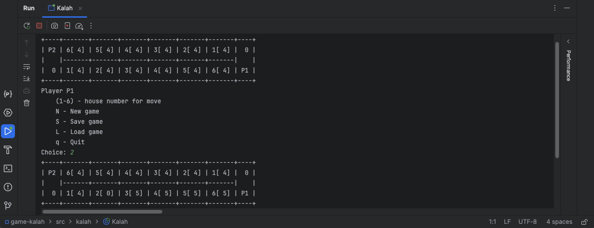
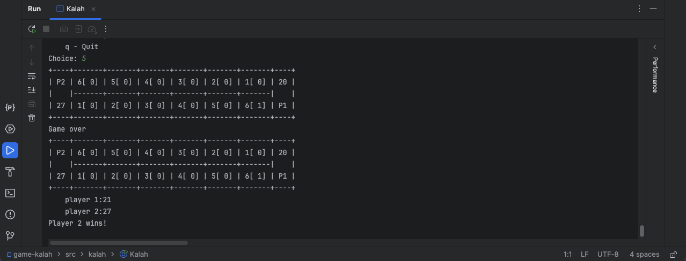
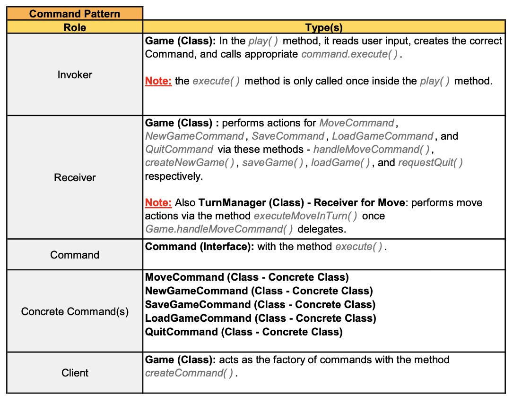
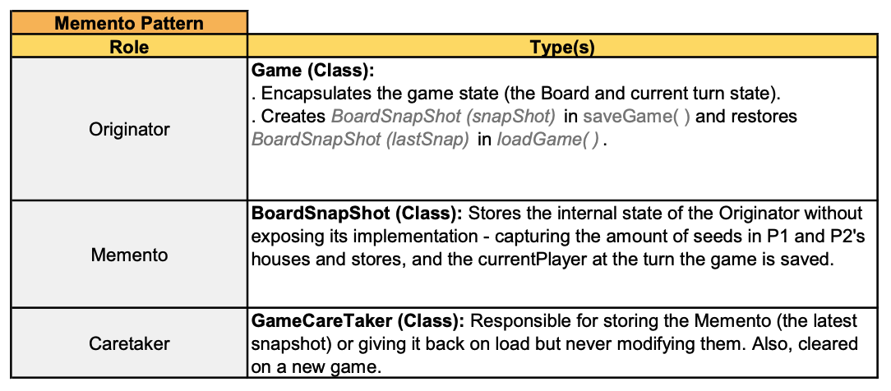

# Kalah

A Java implementation of the classic Kalah board game, developed as part of **COMPSCI 701** at the **University of Auckland**.

This project demonstrates:

- Object-Oriented Design Principles (OOP).
- Design Patterns: Command Pattern and Memento Pattern.
- Separation of Concerns
- State Management.
- Game Logic Implementation.
- Maintainable Software Design.



## Overview

Kalah is a two-player strategy board game in which players distribute seeds across houses and stores while attempting to capture more seeds than their opponent.

This implementation supports:
* Full Kalah gameplay.
* Save and Load functionality.
* New Game reset functionality.
* Turn management and rule enforcement.
* Board state restoration.
* Command-based user actions.

The project was developed using a modular object-oriented architecture to separate responsibilities such as board management, move execution, state persistence, and user commands.


## Prerequisites

- Java 8+
- IntelliJ IDEA (Recommended)


## Project Structure

```text
game-kalah/
|-- docs/                   # Project documentation and screenshots.
|-- .github/
|   |-- workflows/          # Continuous integration workflow.
|-- resources/              # Course-provided testing and I/O support files.
|-- src/
|   |-- kalah/
|   |     |-- Kalah.java    # Application entry point.
|   |     |-- ...           # Additional classes supporting game logic and functionality.
|-- game-kalah.iml          # IntelliJ IDEA project configuration.
|-- Makefile                # Build and test automation.
|-- README.md
```

## Game Features

### Standard Kalah Gameplay

The game implements the traditional Kalah rules, including:

- Seed sowing across houses and stores.
- Capturing seeds from the opponent's side.
- Extra turns when the last seed lands in the player's store.
- End-game detection.
- Winner determination based on the final seed count across houses and stores.

### New Game

Players can restart the game at any time. Features include:

- Resetting the board to its initial state.
- Resetting the turn order to Player 1.
- Clearing any previously saved game state.

### Save and Load Game

Players can save the current game state and restore it later.
- Saved information includes:
    - Seed counts in all houses.
    - Seed counts in both stores.
    - The current player's turn.

- Features include:
    - Save the current game state.
    - Load the most recent save.
    - Restore board state and turn order.
    - Continue gameplay from the saved position.

### Turn Management

The game automatically manages:

- Player turn switching.
- Extra turns awarded by the game rules.
- Move validation.
- Game-over conditions.

### Input Validation

The game validates user input and provides feedback for invalid actions, including:

- Invalid house numbers.
- Non-numeric inputs.
- Empty house selections.
- Out-of-range move selections.

### Console-Based User Interface

The game is played through a console interface that displays:

- The current board state.
- Available player actions.
- Turn information.
- Game results and winner announcements.




## Design Pattern Implementation

This project applies the Command Pattern and Memento Pattern to support maintainable user actions and game state management.

### Command Pattern

The Command Pattern is used to encapsulate user actions such as moving, starting a new game, saving, loading, and quitting.


### Memento Pattern

The Memento Pattern is used to save and restore the current board state without exposing the internal implementation of the board.
